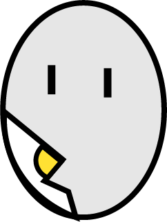

<h1 align="center">
   
  <!-- Link externo ou local(.github). -->
  
     Ovo-timer
 
</h1>

  Crônometro para preparação de ovo. 

  

<!-- Description 2 -->
<!-- Descreva seu projeto. -->
<h2>
  
 Sobre o projeto
</h2>
Um pequeno site experimental, na qual criei para aprimorar minhas habilidades e aprender a utilizar efeitos sonoros aplicados no html e js. E, claro, para nunca mais errar o ponto do ovo.
